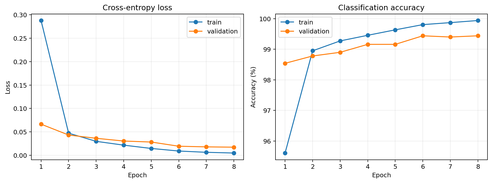
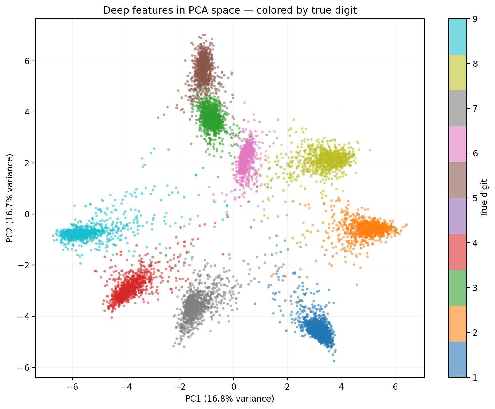
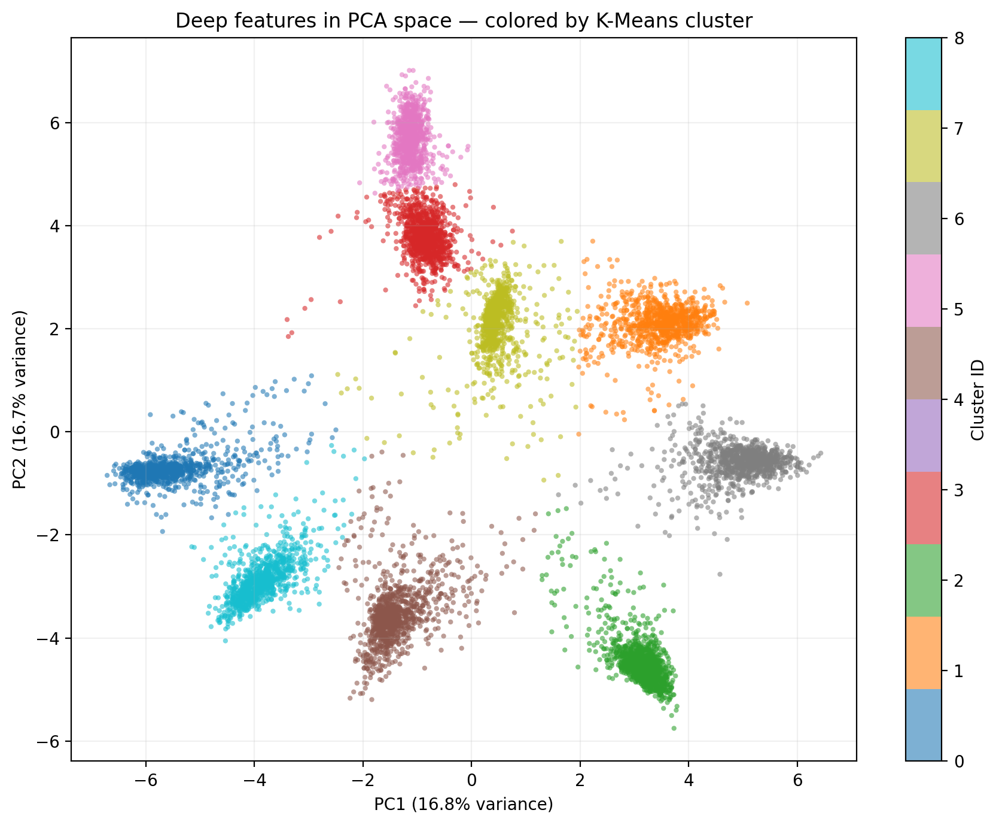
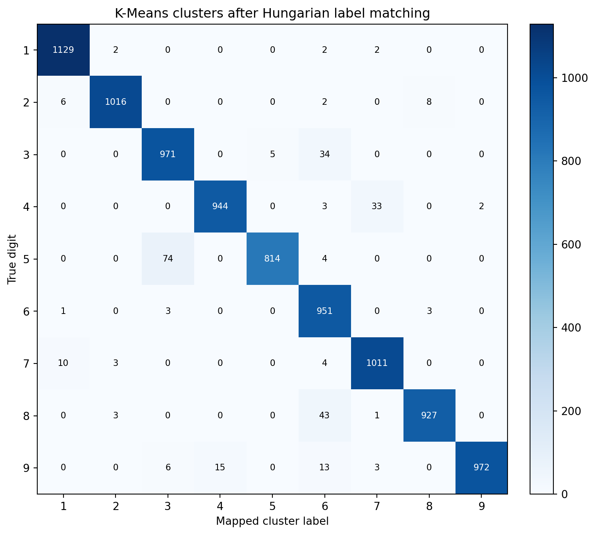

# MNIST CNN Feature Interpretability

这个项目研究一个直观问题：CNN 学会识别手写数字后，它的深层特征是否自然形成了可分离的类别结构？

实验先在 MNIST 0–9 上训练 CNN，再提取分类器之前的 64 维深层特征。随后只选择测试集数字 1–9，将特征标准化、通过 PCA 压缩到二维，最后运行 9 类 K-Means。真实标签不参与 PCA 或聚类，只用于事后评估和可视化。

## Results

| Metric | Result |
|---|---:|
| CNN test accuracy, digits 0–9 | **99.52%** |
| CNN test accuracy, digits 1–9 | **99.47%** |
| K-Means accuracy after Hungarian matching | **96.84%** |
| Cluster purity | **96.84%** |
| Adjusted Rand Index | **0.9321** |
| Normalized Mutual Information | **0.9318** |
| Silhouette score | **0.7012** |
| Variance explained by PC1 + PC2 | **33.49%** |

实验环境：NVIDIA GeForce RTX 5070 Ti、PyTorch 2.9.0 + CUDA 13.0、8 epochs、随机种子 42。

### Training curves



### PCA colored by true digit



### PCA colored by K-Means cluster



### Cluster confusion matrix

簇编号本身没有数字语义。下图先用匈牙利算法寻找簇与数字的一一最优对应，再绘制混淆矩阵。



最明显的混淆是 `5 → 3`、`8 → 6` 和 `3 → 6`。数字 5 的聚类召回率最低，为 91.3%；其他多数数字达到 95%–99%。

## Method

```text
MNIST image
    ↓
four convolution layers + batch normalization + ReLU
    ↓
64-dimensional penultimate-layer feature
    ↓
standardization → PCA (2D) → K-Means (k=9)
    ↓
ARI / NMI / purity / silhouette / Hungarian accuracy
```

CNN 在 0–9 上训练以保持标准 MNIST 分类任务；可解释性分析时排除 0，仅分析目标数字 1–9。

## Quick start

先根据设备从 [PyTorch installation guide](https://pytorch.org/get-started/locally/) 安装 PyTorch，再运行：

```bash
pip install -r requirements.txt
python train_and_analyze.py --epochs 8 --batch-size 256 --num-workers 4
```

首次执行会自动下载 MNIST，结果写入 `results/`。CPU 示例：

```bash
python train_and_analyze.py --epochs 8 --force-cpu --num-workers 0
```

快速流水线测试：

```bash
python train_and_analyze.py --epochs 1 --max-train-samples 3000 --max-test-samples 1000 --val-size 500 --num-workers 0 --output-dir smoke_results
```

完整环境说明见 [`requirement.md`](requirement.md)。

## Outputs

| File | Description |
|---|---|
| `results/analysis_report.md` | 自动生成的中文分析报告 |
| `results/metrics.json` | 分类、聚类和 PCA 指标 |
| `results/training_curves.png` | 损失和准确率曲线 |
| `results/pca_true_labels.png` | 按真实数字着色的二维特征 |
| `results/pca_kmeans_clusters.png` | 按无监督簇着色的二维特征 |
| `results/cluster_confusion_matrix.png` | 簇映射后的混淆矩阵 |
| `results/cluster_label_crosstab.csv` | 簇与真实数字交叉表 |
| `results/best_mnist_cnn.pt` | 最佳模型；默认忽略，可重新训练生成 |

## An interpretive takeaway

这个实验最有启发性的地方，是监督分类目标在中间表示中塑造出了可被无监督方法恢复的几何结构。K-Means 没看过数字标签，却能在二维投影中以 96.84% 的匹配准确率找回九类数字。这说明网络不仅学会了分类边界，也把视觉语义相似的样本组织到了邻近区域。

不过，二维 PCA 只保留 33.49% 的线性方差。因此散点图是高维结构的一扇窗口，而不是结构本身：二维里重叠的样本未必在 64 维空间中不可分，一张漂亮的二维图也不能单独证明模型拥有稳健或因果的概念表示。

`5/3`、`8/6` 和 `3/6` 的混淆给出了下一步方向：回看相应样本的笔画形态，比较不同网络层中的聚类演化，并将二维 K-Means 与原始 64 维 K-Means、UMAP/t-SNE 或线性探针做对照。可解释性由此从“展示散点图”转向“提出并验证关于表示空间的假设”。

## Reproducibility

- 固定 Python、NumPy 和 PyTorch 随机种子为 42。
- 官方训练集固定划分为 55,000 个训练样本和 5,000 个验证样本。
- 最佳模型只根据验证集准确率选择，测试集不参与模型选择。
- K-Means 使用 `n_clusters=9, n_init=20`，真实标签只用于事后评估。
